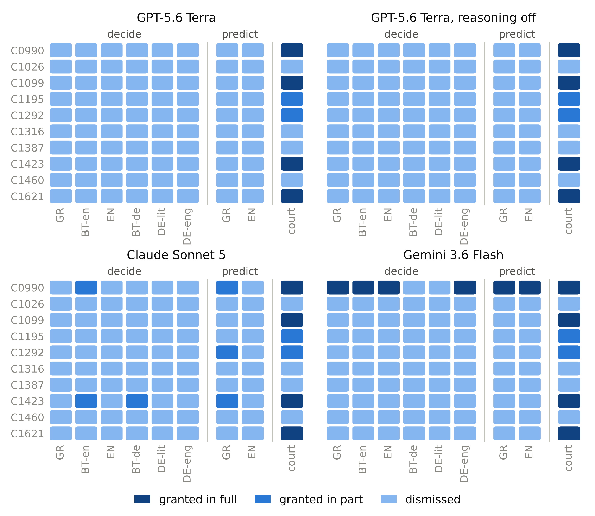

**Supplementary Figure 1.** Modal outcome per case for each model, with the court's order. Each cell is the outcome chosen most often across the draws for that case: 31 per version (62 for Greek) under the decide framing, 15 (30 for Greek) under the predict framing. GR: Greek original; BT-en: Greek back-translation of the English; EN: English; BT-de: Greek back-translation of the German; DE-lit: German with German Part 24 terms; DE-eng: German with the English Part 24 terms.

